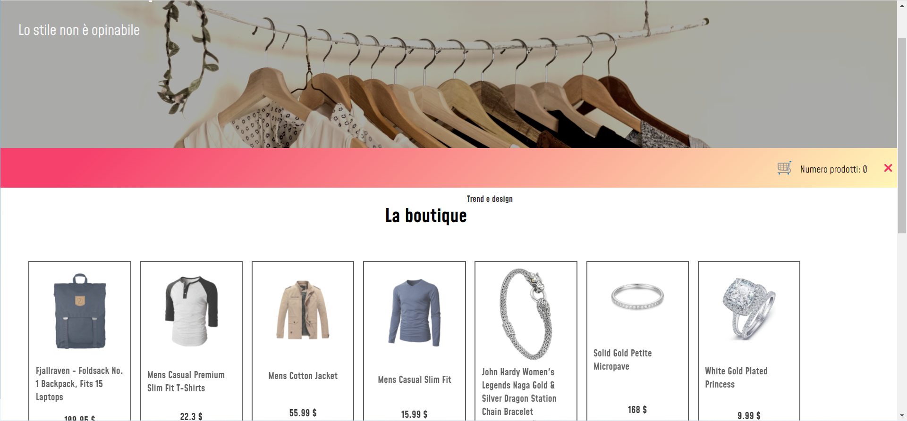

# la-boutique

**This is a Small marketplace that has been done for Edgemony Bootcamp**

*on this excercise we used Javascript for generate the html and CSS for the style*

**This is a preview of the project**

**There is a list of the funcion we implemented for the project**

- fetch a repo from a server 
- create a cart for add the product
- implement a modal funcion when we add something to the cart a pop up message will inform the user
- use the local storage memory for save the product added to cart 
- create a review page
